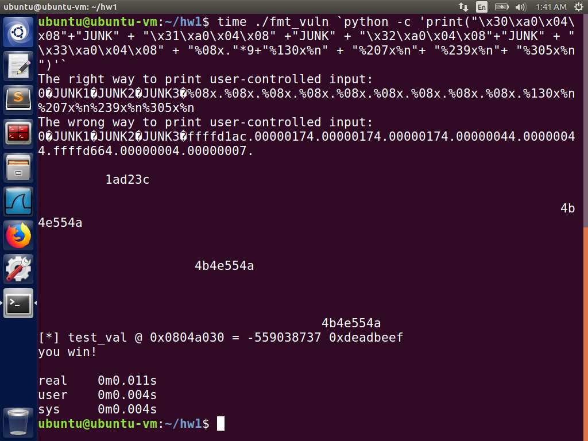

Here you will leverage a format string vulnerability in the program fmt_vuln. The program prints out whatever is provided by the user in the argument via printf. A static variable in the program test_val controls the authentication process. Only if you can overwrite test_val with 0xdeadbeef can you successfully go through authentication, in which case the program prints "you win!"

