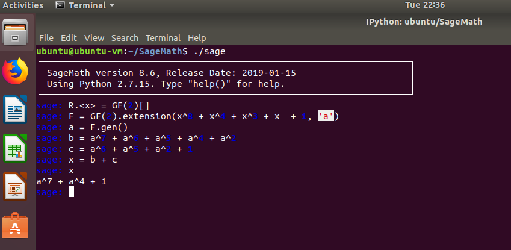
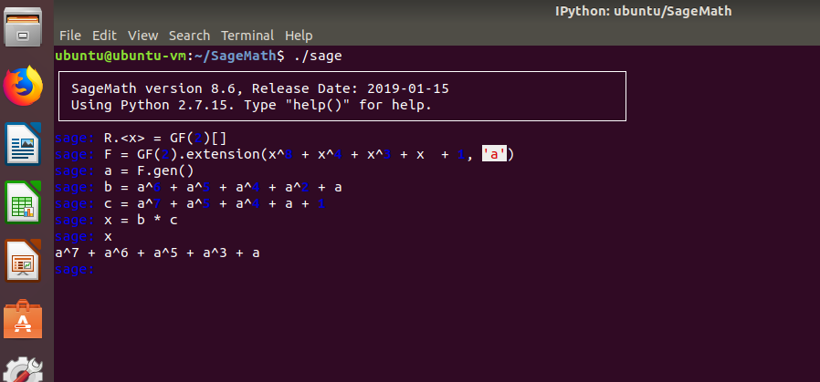
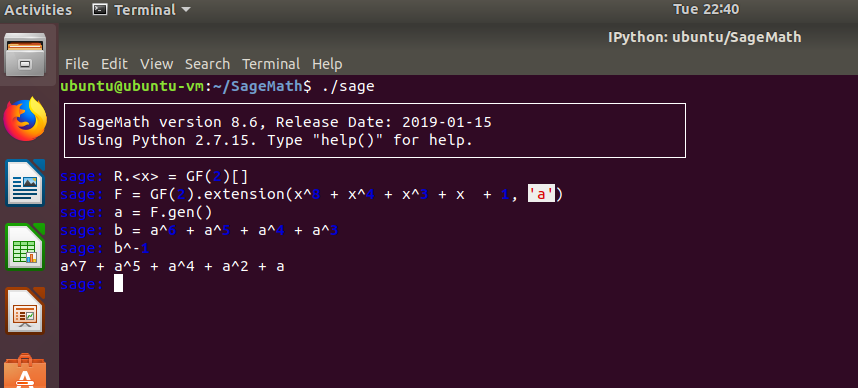

# GP(2^8) for AES

This exercise makes preparation for implementing AES. You are required to use Sage to construct a GP(2^8) finite field. It can be created by constructing a polynomial ring over GP(2).

1. Create a finite field GP(2^8) leveraging polynomial.

2. Define the modular polynomial m(x).

3. Use the defined finite filed F to calculate the following. 

Note: Translate the numbers into polynomials and recover the results back to HEX bytes.

- F4+65

- 76*B3

- 78^-1

